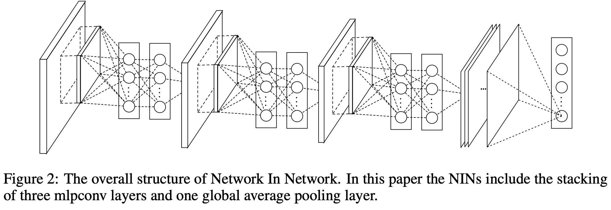

# CNN

## 组件

### 卷积层

(TODO)

### 池化层

减少输出的数量，同时减少参数量，避免过拟合。

近期，池化层并不是很受青睐。部分原因是：

- 现在的数据集又大又复杂，我们更关心欠拟合问题。
- Dropout 是一个更好的正则化方法。
- 池化导致信息损失。想想最大池化的例子，*n* 个数字中我们只保留最大的，把余下的 *n-1* 完全舍弃了。

注意：池化层的输出深度与输入的深度相同。另外池化操作是分别应用到每一个深度切片层。

#### 最大池化、平均池化

(TODO)

#### 全局平均池化（GAP）

[Network In Network](https://arxiv.org/abs/1312.4400) [[review]](https://openreview.net/forum?id=ylE6yojDR5yqX)

### 全连接层

(TODO)

## 经典架构(TODO)

### AlexNet

### VGG

### GoogleNet

### ResNet

### DenseNet

