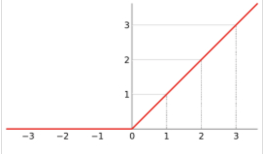
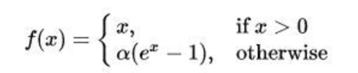

# 激活函数

- 激活函数的作用是？
- 各个激活函数的由来是？
- 激活函数有什么缺点吗？

## 0x00 开胃小菜

​		深度学习模型与大多数传统模型的不同之处在于：它能够很好地学习变量之间非线性的函数关系。激活函数就是深度学习建模非线性关系的关键。

## 0x01 正餐

#### Sigmoid

$ sigmoid(x)=\frac{1}{1+e^{-x}}$

sigmoid函数将数值压制在0和1之间。

 #### tanh

tanh函数将数值压制在-1和1之间。

#### ReLu

由Geoff Hinton首次提出的。ReLU代表“修正线性单元”，它是带有卷积图像的输入x的$max(x,0)$。ReLU函数将矩阵x内所有负值都设为零，其余的值不变。ReLU函数的计算常是在卷积之后进行的，ReLU与tanh函数和sigmoid函数一样同属于“非线性激活函数”。

##### 缺点

- 负数部分梯度为0，导致某些神经元永远不会被激活，对应参数永远不会被更新。

  参数随机初始化时或者学习率过大（参数更新过大）都可能导致神经元失效。

  可以考虑使用Xavier初始化或者使用adagrad自动调节学习率来缓解神经元失效问题。

- ReLU的输出不是以0为中心的

  

#### LeakyRelu

$f(x)=max(ax,x)$

用来解决ReLU带来的神经元失效的问题，a用于保证负轴的信息不至于全部丢失，通常取a=0.01。但是其表现并不一定比ReLU好。

#### ELU（指数线性函数）

## 0x02 餐后甜品

## 0x03 下午茶

## 0x04 宵夜

